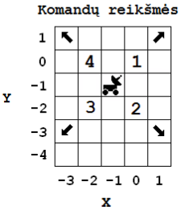

Mėnuleigis
==========

Mėnuleigiui, matomam žemėlapio langelyje, kurio koordinatės $(x_0, y_0)$, siunčiamos judėjimo komandų sekos.

Vykdydamas bet kurią komandą, mėnuleigis pervažiuoja į gretimą langelį nurodyta kryptimi (komandų reikšmės pavaizduotos paveiksle).



Mėnuleigis vykdo komandų sekas, pradėdamas jas visada iš to paties langelio $(x_0, y_0)$. Seka stabdoma tada, kai mėnuleigis sugrįžta į pradinį langelį, kurio koordinatės $(x_0, y_0)$, arba įvykdo visas sekos komandas.

**Parašykite programą**, kuri, patikrinusi kiekvieną komandų seką, nustatytų:

- sekos stabdymo priežastį,
- įvykdytas komandas ir jų skaičių,
- kuriame langelyje mėnuleigis baigė vykdyti komandas, jei negrįžo į pradinį langelį.

**Pradiniai duomenys**

Duomenys yra tekstiniame faile `U2.txt`:

- pirmoje eilutėje yra mėnuleigio pradžios langelio koordinatės $(x_0, y_0), -100 < x_0 < 100, -100 < y_0 < 100$,
- antroje eilutėje – komandų sekų skaičius $n\ (1 \leq n \leq 10)$,
- kitose $n$ eilučių yra šie duomenys, atskirti tarpo simboliais:
    * sekos ilgis $k\ (1 \leq k \leq 30)$,
    * $k$ komandų, užkoduotų skaičiais nuo 1 iki 4.
    
**Rezultatai**

Tekstiniame faile `U2rez.txt` įrašykite šiuos duomenis, skirdami vieną eilutę kiekvienai komandų sekai (duomenys turi būti išvedami ta pačia tvarka, kuria sekos pateiktos pradinių duomenų faile):

- sekos stabdymo priežastis, kuriai skiriama 20 pozicijų, t. y. viena iš šių priežasčių:<br>
    `pasiektas tikslas` – sugrįžus į pradinį langelį,<br>
    `sekos pabaiga` – įvykdžius visas sekos komandas, bet nepasiekus pradinio langelio,
- mėnuleigio įvykdytų komandų, atskirtų tarpais, seka ir tarpo simbolis,
- kiek komandų įvykdyta,
- jei mėnuleigis nesugrįžo į pradinį langelį – tarpo simbolis ir langelio, kuriame baigė vykdyti komandų seką, koordinatės.

**Nurodymai**

- Programoje naudokite įrašo duomenų tipą vienos komandų sekos vykdymo rezultatams saugoti.
- Programoje naudokite masyvo duomenų tipą įvykdytų komandų sekoms saugoti.
- Programoje nenaudokite sakinių, skirtų darbui su ekranu.

**Duomenų ir rezultatų pavyzdys**

`U2.txt`

```
1 1
3
9 1 4 1 2  3 2 3 4 1
1 1
3 2 3 2
```

`U2rez.txt`

```
pasiektas tikslas    1 4 1 2 3 2 3 4 8
sekos pabaiga        1 1 2 2
sekos pabaiga        2 3 2 3 2 -2
```


Šaltinis
--------

http://nec.lt/failai/4914_2014-IT-1_uzd-PK.pdf